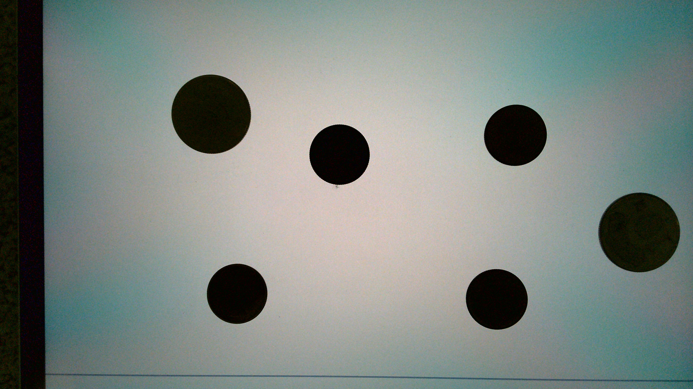
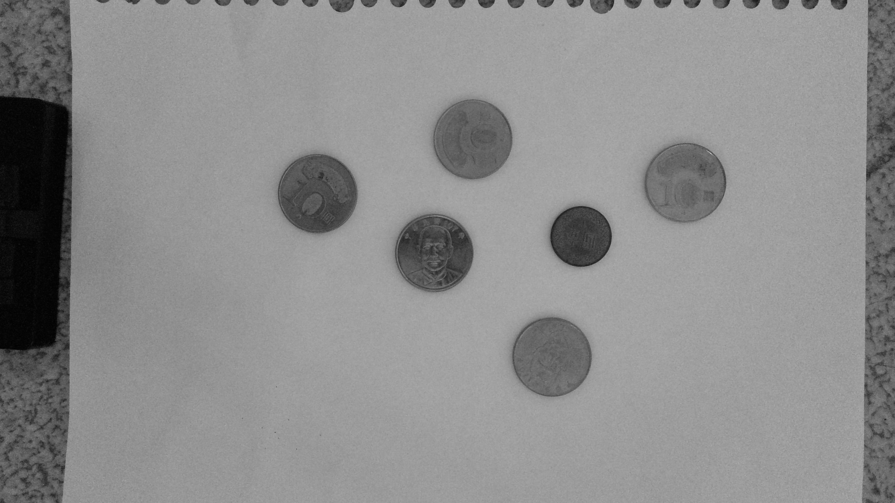
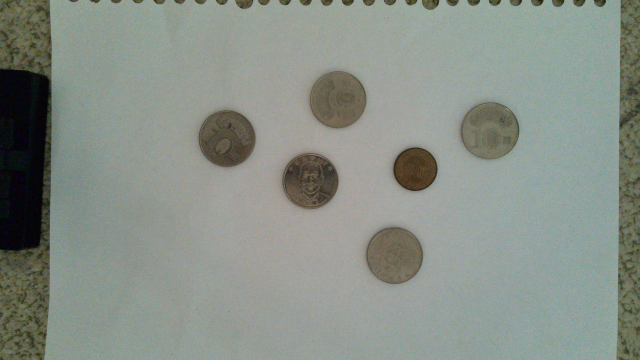
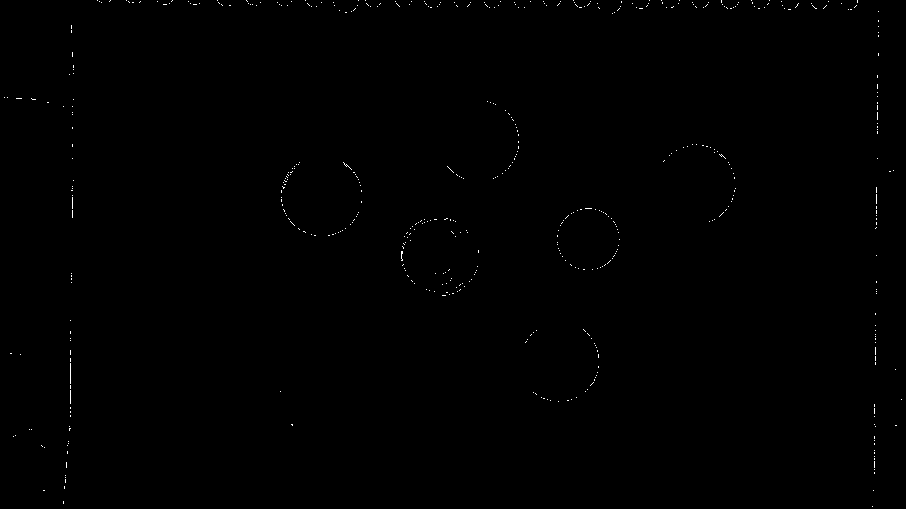

# DAY1：OpenCV 入門練習

- **作者**：harry123180
- **主題**：熟悉影像讀取、轉換、幾何操作與簡易檢測

---

## 資料夾結構

```
DAY1/
├── README.md              # 本說明文件
├── step01_read_image.py   # 讀取並顯示影像
├── step02_to_grayscale.py # 轉換為灰階
├── step03_resize_image.py # 調整影像尺寸
├── step04_draw_shapes.py  # 繪製圖形標註
├── step05_detect_edges.py # Canny 邊緣偵測
├── step06_detect_circles.py # 霍夫圓形偵測
├── images/                # 來源影像資料夾
│   ├── frontlit_detail/   # 正面打光（可見硬幣細節）
│   └── backlit_silhouette/ # 背光剪影（高對比輪廓）
└── output/                # 程式輸出結果
```

---

## 快速開始

### 1. 安裝依賴

```bash
pip install opencv-python numpy
```

### 2. 執行範例

在 `DAY1/` 目錄下執行：

```bash
python step01_read_image.py
python step02_to_grayscale.py
# ... 依序執行其他腳本
```

---

## 來源影像說明

本課程使用台灣硬幣作為圓形偵測的練習素材：

### 正面打光 (`frontlit_detail/`)
在一般光源下拍攝，可清楚看到硬幣的面額與圖案細節。

| 檔名範例 | 說明 |
|----------|------|
| `frontlit_06coins_01.jpg` | 6 枚硬幣 |
| `frontlit_09coins_01.jpg` | 9 枚硬幣 |
| `frontlit_13coins_01.jpg` | 13 枚硬幣 |


### 背光剪影 (`backlit_silhouette/`)
從背面打光，硬幣呈現黑色剪影，適合練習高對比的輪廓偵測。

| 檔名範例 | 說明 |
|----------|------|
| `backlit_04coins_01.jpg` | 4 枚硬幣 |
| `backlit_10coins_01.jpg` | 10 枚硬幣 |
| `backlit_14coins_01.jpg` | 14 枚硬幣 |



---

## 腳本說明與輸出結果

### Step 01：讀取並顯示影像

**檔案**：`step01_read_image.py`

使用 `cv2.imread()` 讀取影像，`cv2.imshow()` 開啟視窗顯示。

```python
image = cv2.imread(str(image_path))
cv2.imshow("Day1 Step01", image)
```

> 此步驟僅顯示視窗，不產生輸出檔案。

---

### Step 02：轉換為灰階

**檔案**：`step02_to_grayscale.py`

將彩色影像轉為灰階，減少運算量，適合後續邊緣或濾波處理。

```python
gray = cv2.cvtColor(image, cv2.COLOR_BGR2GRAY)
```

**輸出結果**：



---

### Step 03：調整影像尺寸

**檔案**：`step03_resize_image.py`

將影像等比例縮放到指定寬度（預設 640px），使用 `INTER_AREA` 插值獲得平滑縮圖。

```python
resized = cv2.resize(image, target_size, interpolation=cv2.INTER_AREA)
```

**輸出結果**：



---

### Step 04：繪製圖形標註

**檔案**：`step04_draw_shapes.py`

在影像上繪製矩形框與文字，示範 OpenCV 的繪圖功能。

```python
cv2.rectangle(image, top_left, bottom_right, (0, 255, 0), 3)
cv2.putText(image, "Demo Box", position, font, scale, color, thickness)
```

**輸出結果**：


---

### Step 05：Canny 邊緣偵測

**檔案**：`step05_detect_edges.py`

先用高斯模糊降低雜訊，再用 Canny 演算法偵測邊緣輪廓。

```python
blurred = cv2.GaussianBlur(image, (5, 5), 0)
edges = cv2.Canny(blurred, 80, 160)
```

**輸出結果**：



---

### Step 06：霍夫圓形偵測

**檔案**：`step06_detect_circles.py`

使用霍夫變換偵測圓形物件，並用綠色圓圈標記偵測結果。

```python
circles = cv2.HoughCircles(
    blurred,
    cv2.HOUGH_GRADIENT,
    dp=1.2,
    minDist=40,
    param1=120,
    param2=35,
    minRadius=10,
    maxRadius=200,
)
```

**輸出結果**：


---

## 處理流程圖

```
┌─────────────┐
│  原始影像   │
│ (JPG 彩色)  │
└──────┬──────┘
       │
       ▼
┌─────────────┐     ┌─────────────┐
│  Step 02    │────▶│   灰階圖    │
│  灰階轉換   │     │  (減少維度) │
└──────┬──────┘     └─────────────┘
       │
       ▼
┌─────────────┐     ┌─────────────┐
│  Step 05    │────▶│  邊緣圖     │
│ Canny 偵測  │     │ (輪廓線條)  │
└──────┬──────┘     └─────────────┘
       │
       ▼
┌─────────────┐     ┌─────────────┐
│  Step 06    │────▶│  標註圖     │
│ 霍夫圓偵測  │     │ (綠圈標記)  │
└─────────────┘     └─────────────┘
```

---

## 備註

- 所有腳本自動從 `images/frontlit_detail/` 讀取第一張 JPG 圖片
- 若該資料夾為空，會改用 `images/backlit_silhouette/` 的圖片
- 輸出結果統一存放於 `output/` 資料夾
- 建議在教學時逐步執行，讓學員確認每個處理階段的效果
