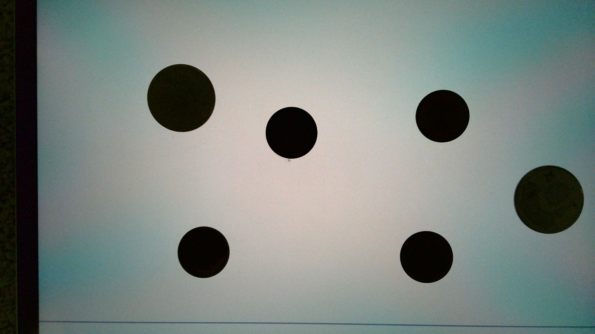
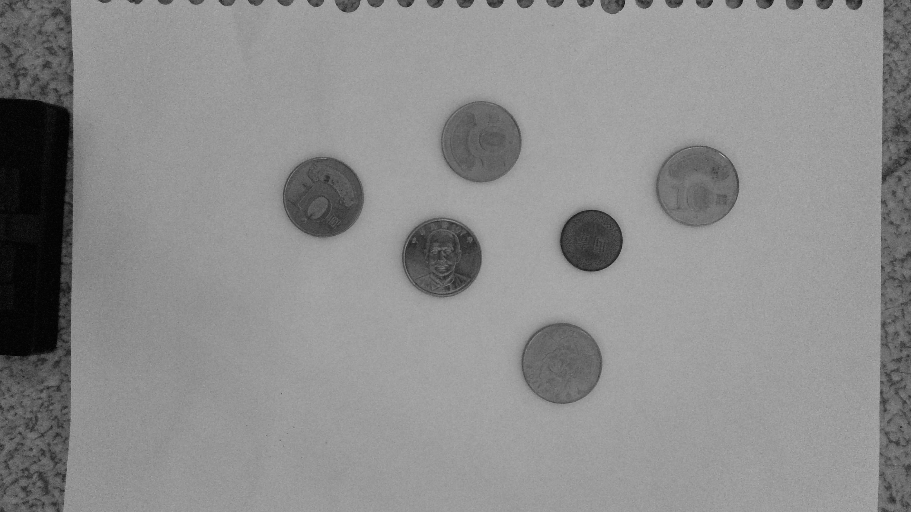
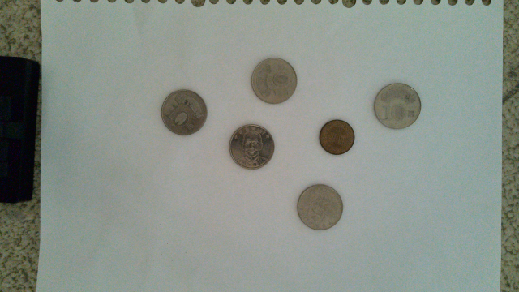
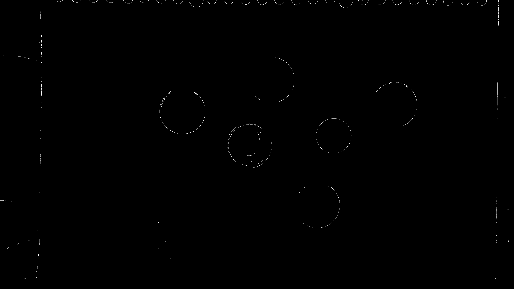

# DAY1：OpenCV 入門練習

- **作者**：harry123180
- **主題**：熟悉影像讀取、轉換、幾何操作與簡易檢測

## 學習目標

完成 DAY1 後，學員能夠：

1. 用 OpenCV 讀取 / 顯示 / 儲存影像，並理解 BGR vs RGB 的差異
2. 掌握常見前處理流程：灰階、縮放、高斯模糊
3. 能在影像上繪製圖形與文字，做為標註輸出基礎
4. 能使用 Canny 邊緣偵測與霍夫圓形偵測做簡單的物件定位
5. 建立「讀檔 → 前處理 → 偵測 → 標註 → 輸出」的完整思維流程

## 先備知識

- Python 基礎語法（函式、迴圈、路徑操作）
- 命令列基本操作（啟動虛擬環境、`pip install`）

---

## 資料夾結構

```
DAY1/
├── README.md              # 本說明文件
├── step01_read_image.py   # 讀取並顯示影像
├── step02_to_grayscale.py # 轉換為灰階
├── step03_resize_image.py # 調整影像尺寸
├── step04_draw_shapes.py  # 繪製圖形標註
├── step05_detect_edges.py # Canny 邊緣偵測
├── step06_detect_circles.py # 霍夫圓形偵測
├── step07_dual_camera.py   # 雙攝影機 + Mediapipe (FaceMesh / Pose)
├── images/                # 來源影像資料夾
│   ├── frontlit_detail/   # 正面打光（可見硬幣細節）
│   ├── backlit_silhouette/ # 背光剪影（高對比輪廓）
│   └── lowlight_ambient/  # 低光環境（練習低對比偵測）
└── output/                # 程式輸出結果
```

---

## 快速開始

### 1. 安裝依賴

```bash
pip install opencv-python numpy
```

### 2. 執行範例

在 `DAY1/` 目錄下執行：

```bash
python step01_read_image.py
python step02_to_grayscale.py
# ... 依序執行其他腳本
```

---

## 來源影像說明

本課程使用台灣硬幣作為圓形偵測的練習素材：

### 正面打光 (`frontlit_detail/`)
在一般光源下拍攝，可清楚看到硬幣的面額與圖案細節。

| 檔名範例 | 說明 |
|----------|------|
| `frontlit_06coins_01.jpg` | 6 枚硬幣 |
| `frontlit_09coins_01.jpg` | 9 枚硬幣 |
| `frontlit_13coins_01.jpg` | 13 枚硬幣 |


### 背光剪影 (`backlit_silhouette/`)
從背面打光，硬幣呈現黑色剪影，適合練習高對比的輪廓偵測。

| 檔名範例 | 說明 |
|----------|------|
| `backlit_04coins_01.jpg` | 4 枚硬幣 |
| `backlit_10coins_01.jpg` | 10 枚硬幣 |
| `backlit_14coins_01.jpg` | 14 枚硬幣 |



### 低光環境 (`lowlight_ambient/`)
在較暗的環境光下拍攝，適合練習低對比場景的偵測。

| 檔名範例 | 說明 |
|----------|------|
| `lowlight_01.jpg` ~ `lowlight_12.jpg` | 12 張低光環境硬幣照片 |

---

## 腳本說明與輸出結果

### Step 01：讀取並顯示影像

**檔案**：`step01_read_image.py`

使用 `cv2.imread()` 讀取影像，`cv2.imshow()` 開啟視窗顯示。

```python
image = cv2.imread(str(image_path))
cv2.imshow("Day1 Step01", image)
```

> 此步驟僅顯示視窗，不產生輸出檔案。

---

### Step 02：轉換為灰階

**檔案**：`step02_to_grayscale.py`

將彩色影像轉為灰階，減少運算量，適合後續邊緣或濾波處理。

```python
gray = cv2.cvtColor(image, cv2.COLOR_BGR2GRAY)
```

**輸出結果**：



---

### Step 03：調整影像尺寸

**檔案**：`step03_resize_image.py`

將影像等比例縮放到指定寬度（預設 640px），使用 `INTER_AREA` 插值獲得平滑縮圖。

```python
resized = cv2.resize(image, target_size, interpolation=cv2.INTER_AREA)
```

**輸出結果**：



---

### Step 04：繪製圖形標註

**檔案**：`step04_draw_shapes.py`

在影像上繪製矩形框與文字，示範 OpenCV 的繪圖功能。

```python
cv2.rectangle(image, top_left, bottom_right, (0, 255, 0), 3)
cv2.putText(image, "Demo Box", position, font, scale, color, thickness)
```

**輸出結果**：


---

### Step 05：Canny 邊緣偵測

**檔案**：`step05_detect_edges.py`

先用高斯模糊降低雜訊，再用 Canny 演算法偵測邊緣輪廓。

```python
blurred = cv2.GaussianBlur(image, (5, 5), 0)
edges = cv2.Canny(blurred, 80, 160)
```

**輸出結果**：



---

### Step 06：霍夫圓形偵測

**檔案**：`step06_detect_circles.py`

使用霍夫變換偵測圓形物件，並用綠色圓圈標記偵測結果。

```python
circles = cv2.HoughCircles(
    blurred,
    cv2.HOUGH_GRADIENT,
    dp=1.2,
    minDist=40,
    param1=120,
    param2=35,
    minRadius=10,
    maxRadius=200,
)
```

**輸出結果**：


---

### Step 07：雙攝影機 + Mediapipe（銜接 DAY2）

**檔案**：`step07_dual_camera.py`

同時開啟兩支攝影機：Camera 0 跑 Mediapipe `FaceMesh`（臉部 468 個網格點 + 虹膜），Camera 1 跑 `Pose`（人體 33 個骨架點），示範如何在同一程式中整合多個 Mediapipe 模型。

```bash
pip install mediapipe
python step07_dual_camera.py
```

**操作鍵**：

| 按鍵 | 功能 |
|------|------|
| `ESC` | 結束程式 |
| `v`   | 切換「水平並排 / 垂直堆疊」版面 |

**程式重點**：

- `cv2.VideoCapture(0)` / `cv2.VideoCapture(1)` 分別代表內建與外接攝影機（順序視作業系統而定）
- Mediapipe 需要 RGB 輸入，所以需 `cv2.cvtColor(frame, cv2.COLOR_BGR2RGB)`
- 設 `rgb.flags.writeable = False` 可讓 Mediapipe 免於複製資料，提升效能
- 最終透過 `np.hstack` / `np.vstack` 拼接兩張 frame 做顯示

> 此範例做為 DAY2 Mediapipe 章節的前導暖身。若你的電腦只有一支攝影機，可先略過 step07，直接進 DAY2 的單鏡頭範例。

---

## 處理流程圖

```
┌─────────────┐
│  原始影像   │
│ (JPG 彩色)  │
└──────┬──────┘
       │
       ▼
┌─────────────┐     ┌─────────────┐
│  Step 02    │────▶│   灰階圖    │
│  灰階轉換   │     │  (減少維度) │
└──────┬──────┘     └─────────────┘
       │
       ▼
┌─────────────┐     ┌─────────────┐
│  Step 05    │────▶│  邊緣圖     │
│ Canny 偵測  │     │ (輪廓線條)  │
└──────┬──────┘     └─────────────┘
       │
       ▼
┌─────────────┐     ┌─────────────┐
│  Step 06    │────▶│  標註圖     │
│ 霍夫圓偵測  │     │ (綠圈標記)  │
└─────────────┘     └─────────────┘
```

---

## 備註

- `step01` ~ `step06` 自動從 `images/frontlit_detail/` 讀取第一張 JPG 圖片；若該資料夾為空，會改用 `images/backlit_silhouette/`
- `step07` 需要兩支實體攝影機，並額外安裝 `mediapipe`
- 輸出結果統一存放於 `output/` 資料夾
- 建議在教學時逐步執行，讓學員確認每個處理階段的效果

---

## 常見問題

### Q1：`cv2.imread()` 回傳 `None`？
- 檔案路徑含中文或空白：改用 `cv2.imdecode(np.fromfile(path, np.uint8), cv2.IMREAD_COLOR)`
- 副檔名錯誤（.JPG vs .jpg）：`Path.glob("*.jpg")` 在 Windows 不分大小寫，Linux 分；請檢查真實檔名

### Q2：`cv2.imshow()` 視窗打開後立即關閉？
- 少了 `cv2.waitKey(0)`（會一打開就關）。`waitKey(0)` 代表等待任意鍵

### Q3：HoughCircles 偵測不到圓、或誤判太多？
- 先把影像縮到 `1024px` 以內避免計算量爆炸
- 調 `param2`：值越低越容易偵測（也越多雜訊）；值越高越嚴格
- 調 `minRadius` / `maxRadius` 限制搜尋範圍
- 在低光影像（`lowlight_ambient/`）先套 `cv2.equalizeHist` 或 CLAHE 提升對比

### Q4：輸出圖的顏色偏藍/偏黃？
- OpenCV 預設使用 **BGR**，若你直接丟進 matplotlib（RGB）會色彩反轉；記得先 `cv2.cvtColor(image, cv2.COLOR_BGR2RGB)`

---

## 延伸任務

- 寫一個 `step08_count_coins.py`，結合 step05 + step06 計算硬幣數量並疊加於畫面
- 將 step06 改為讀取整個 `lowlight_ambient/` 資料夾，比較偵測準確率
- 嘗試替換成你自己的硬幣或圓形物體照片
