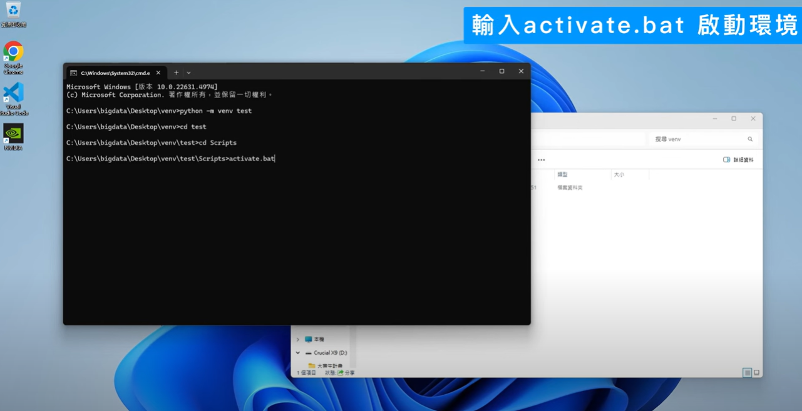

# Visual Studio Code Python 開發入門教學

## 教學概述
本教學將指導您如何在 Visual Studio Code 中使用 Python 3 建立、執行和除錯 Python 應用程式，並學習使用虛擬環境、套件管理等技能。

一、安裝python


二、開啟CMD


三、查看python版本


四、安裝VScode


五、於VScode中搜尋Python並安裝套件


六、於桌面新增資料夾

七、透過VScode將資料夾打開


八、輸入print並執行


## Venv虛擬環境建置
一、於桌面新增第二個資料夾
二、於桌面新增資料夾並於路徑欄位輸入CMD


三、輸入python-m vene<環境名稱>以建立虛擬環境


四、回終端機並輸入cd<環境名稱>/scripts


五、輸入activate.bat啟動環境




六、查看pip套件指令 輸入 pip list


七、安裝pip套件指令 輸入 pip install <套件名稱>


## VSCode虛擬環境選取
一、進入VSCode中並點擊右下角版本選項


二、點擊Enter interpreter path選項


三、點擊Find 並選取python.exe


完成虛擬環境選取，成功抓到虛擬環境會顯示Python版本(環境名稱)於右下角。
## 前置需求

### 必要軟體
- Python 3
- Visual Studio Code
- VS Code Python 擴充套件

### Python 直譯器安裝

#### Windows
從 python.org 下載並安裝最新版本。若無管理員權限，可透過 Microsoft Store 安裝。

#### macOS
使用 Homebrew 安裝：
```bash
brew install python3
```

#### Linux
內建 Python 3 通常可用，但需安裝 pip：
```bash
# 使用 get-pip.py 安裝 pip
```

### 驗證安裝
```bash
# Linux/macOS
python3 --version

# Windows
py -3 --version
```

## 建立工作環境

### 1. 建立專案資料夾
```bash
mkdir hello
cd hello
code .
```

### 2. 建立虛擬環境

使用命令面板 (Ctrl+Shift+P) 執行 `Python: Create Environment`：

1. 選擇環境類型 (Venv 或 Conda)
2. 選擇 Python 直譯器
3. 等待環境建立完成 (/.venv 資料夾)

### 3. 建立 Python 檔案

建立 `hello.py` 檔案並輸入：

```python
msg = "Roll a dice!"
print(msg)
```

## 執行 Python 程式碼

### 執行方式

1. **執行按鈕**：點擊編輯器右上角的執行按鈕
2. **右鍵選單**：右鍵選擇 `Run Python > Run Python File in Terminal`
3. **選取執行**：選取程式碼後按 Shift+Enter
4. **REPL 模式**：使用命令面板執行 `Python: Start Terminal REPL`

## 除錯設定

### 設定中斷點
1. 在第 2 行按 F9 或點擊行號左側
2. 出現紅色圓點表示中斷點已設定

### 啟動除錯器
1. 按 F5 初始化除錯器
2. 選擇 `Python File` 設定
3. 程式將在中斷點暫停

### 除錯工具列
- 繼續 (F5)
- 逐步執行 (F10)
- 進入函式 (F11)
- 跳出函式 (Shift+F11)
- 重新啟動 (Ctrl+Shift+F5)
- 停止 (Shift+F5)

## 套件管理

### 安裝套件

修改 `hello.py`：
```python
import numpy as np

msg = "Roll a dice!"
print(msg)
print(np.random.randint(1,9))
```

安裝 numpy：
```bash
# macOS
python3 -m pip install numpy

# Windows
py -m pip install numpy

# Linux
python3 -m pip install numpy
```

### 相依性管理

#### 建立 requirements.txt
```bash
# 啟動虛擬環境
source venv/bin/activate  # macOS/Linux
.\venv\Scripts\activate   # Windows

# 匯出套件清單
pip freeze > requirements.txt
```

#### 安裝相依套件
```bash
pip install -r requirements.txt
```

## 進階功能

### IntelliSense
- 自動完成程式碼建議
- 方法提示
- 參數資訊

### Linting
Python 擴充套件提供完整的程式碼檢查支援

### Logpoints
使用 Logpoints 替代 print 陳述式進行除錯，不會中斷程式執行

## 後續學習資源

### Web 框架
- Django
- Flask  
- FastAPI


## 快速參考

### 常用快捷鍵
- `Ctrl+Shift+P`：命令面板
- `F5`：開始除錯
- `F9`：設定中斷點
- `Shift+Enter`：執行選取程式碼
- `Ctrl+S`：儲存檔案

### 檔案結構
```
專案資料夾/
├── .venv/          # 虛擬環境
├── hello.py        # Python 程式碼
└── requirements.txt # 套件清單
```