# Getting Started - 新手入門指南

本指南將帶你從零開始設定 Python 開發環境，適合完全沒有程式經驗的初學者。

---

## 目錄

1. [安裝 Python](#1-安裝-python)
2. [安裝 VSCode 編輯器](#2-安裝-vscode-編輯器)
3. [開啟命令提示字元](#3-開啟命令提示字元)
4. [確認 Python 安裝成功](#4-確認-python-安裝成功)
5. [建立虛擬環境](#5-建立虛擬環境)
6. [啟動虛擬環境](#6-啟動虛擬環境)
7. [安裝套件](#7-安裝套件)
8. [在 VSCode 中設定 Python](#8-在-vscode-中設定-python)
9. [撰寫第一個程式](#9-撰寫第一個程式)

---

## 1. 安裝 Python

前往 [python.org](https://www.python.org/downloads/) 下載 Python 3.10 或更新版本。

安裝時請務必勾選 **「Add Python to PATH」**，這樣才能在命令列中直接使用 `python` 指令。


---

## 2. 安裝 VSCode 編輯器

前往 [code.visualstudio.com](https://code.visualstudio.com/) 下載 Visual Studio Code。

VSCode 是一款免費、輕量的程式碼編輯器，支援多種程式語言和擴充功能。


---

## 3. 開啟命令提示字元

有兩種方式可以開啟命令提示字元（CMD）：

### 方法一：從開始功能表
搜尋「cmd」或「命令提示字元」並開啟。

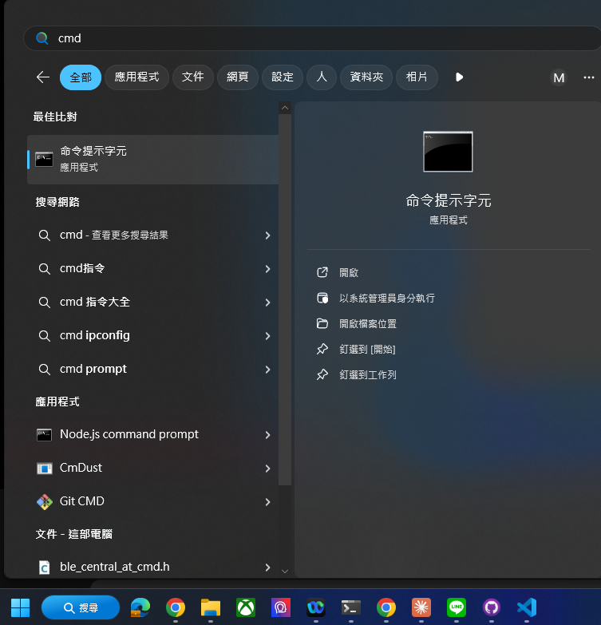

### 方法二：在資料夾中開啟
在檔案總管的路徑欄輸入 `cmd`，會直接在該資料夾開啟命令提示字元。

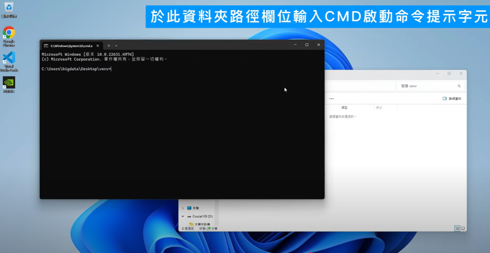

---

## 4. 確認 Python 安裝成功

在命令提示字元中輸入：

```bash
python --version
```

如果看到版本號（例如 `Python 3.10.x`），表示安裝成功。

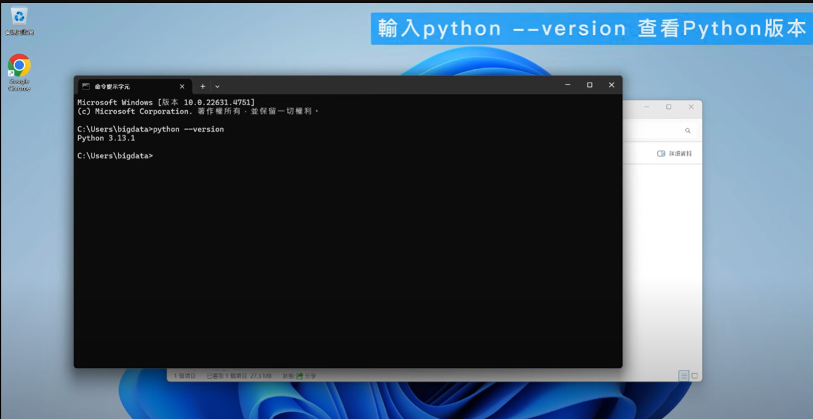

---

## 5. 建立虛擬環境

虛擬環境可以隔離不同專案的套件，避免版本衝突。

### Step 1：建立虛擬環境

在專案資料夾中執行：

```bash
python -m venv .venv
```

`.venv` 是虛擬環境的資料夾名稱，你也可以取其他名字。

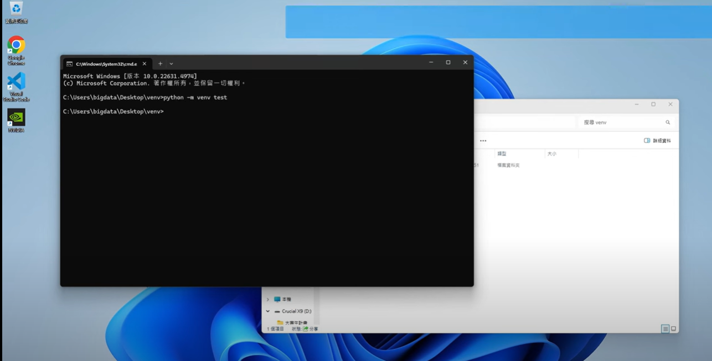


---

## 6. 啟動虛擬環境

### Windows 系統

```bash
.venv\Scripts\activate
```

啟動成功後，命令列前方會出現 `(.venv)` 標示。


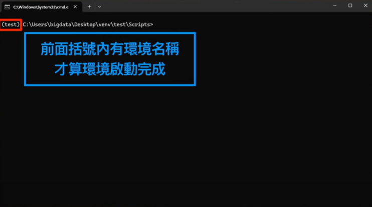

---

## 7. 安裝套件

使用 `pip` 安裝需要的 Python 套件。

### 安裝單一套件

```bash
pip install opencv-python
```


### 從 requirements.txt 安裝

```bash
pip install -r requirements.txt
```

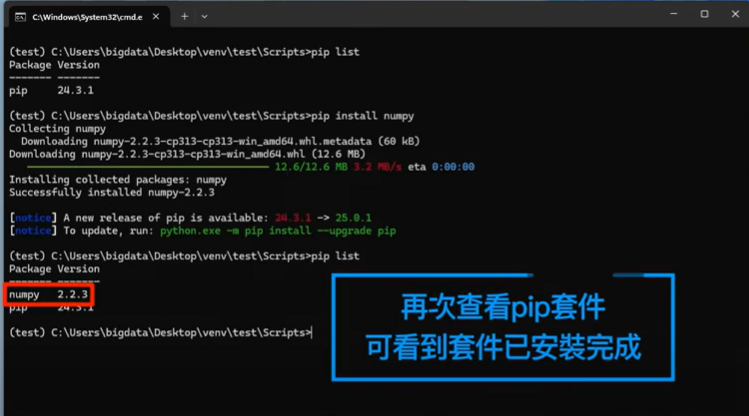

### 查看已安裝的套件

```bash
pip list
```

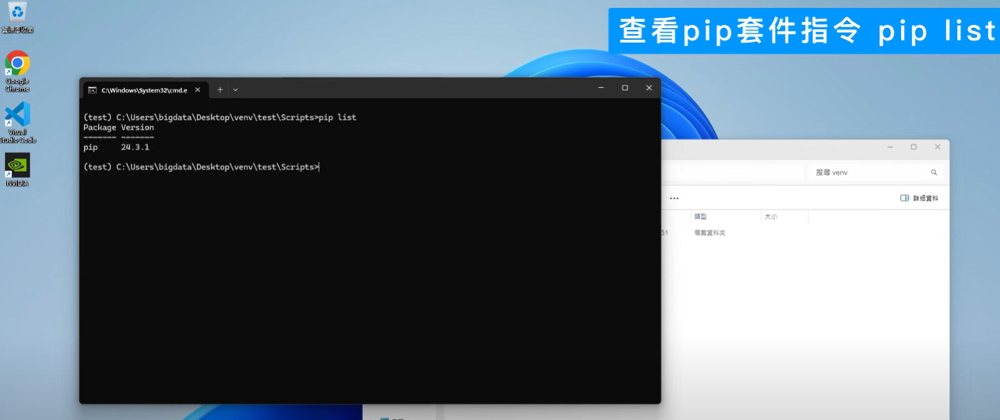

---

## 8. 在 VSCode 中設定 Python

### Step 1：安裝 Python 擴充功能

在 VSCode 左側的擴充功能面板中搜尋「Python」，安裝 Microsoft 官方的 Python 擴充功能。

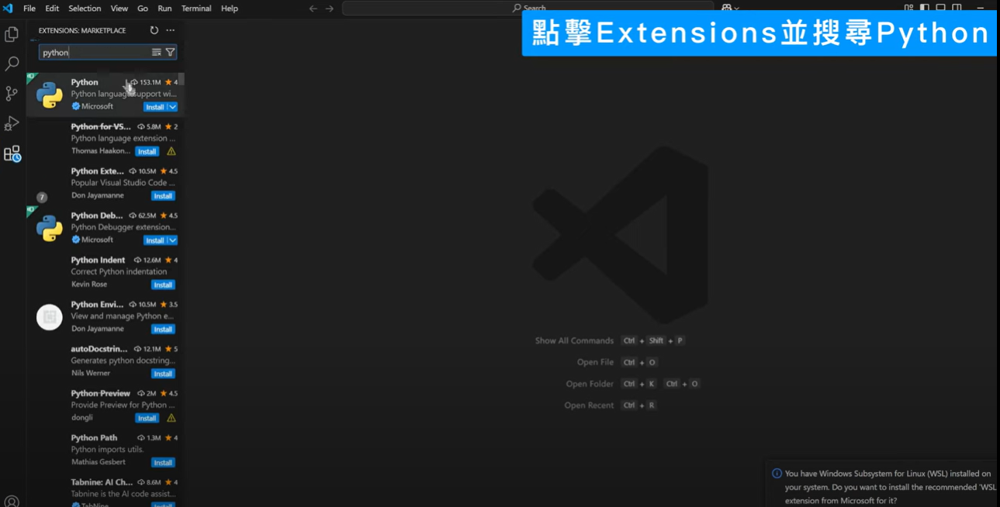

### Step 2：選擇 Python 直譯器

點擊 VSCode 右下角的 Python 版本，選擇虛擬環境中的 Python。

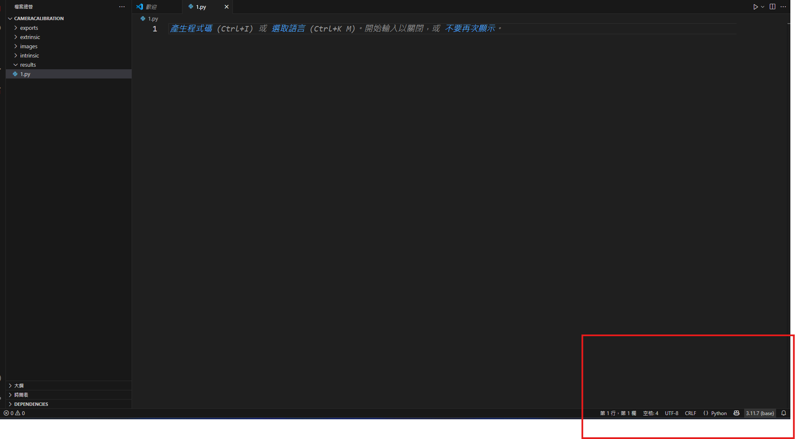


---

## 9. 撰寫第一個程式

### Step 1：建立 Python 檔案

在 VSCode 中新增一個 `.py` 檔案。

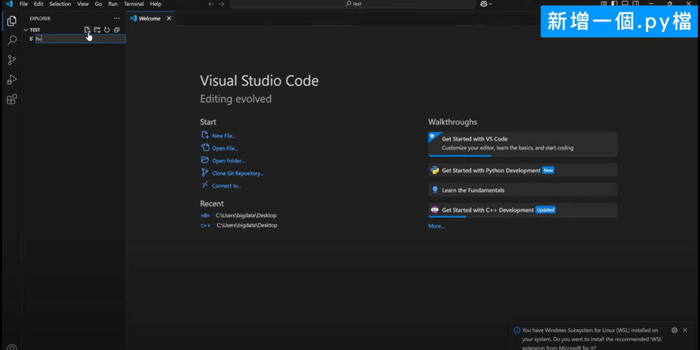

### Step 2：撰寫程式碼

輸入以下程式碼：

```python
print("Hello, World!")
```


### Step 3：執行程式

按下 `F5` 或點擊右上角的執行按鈕。

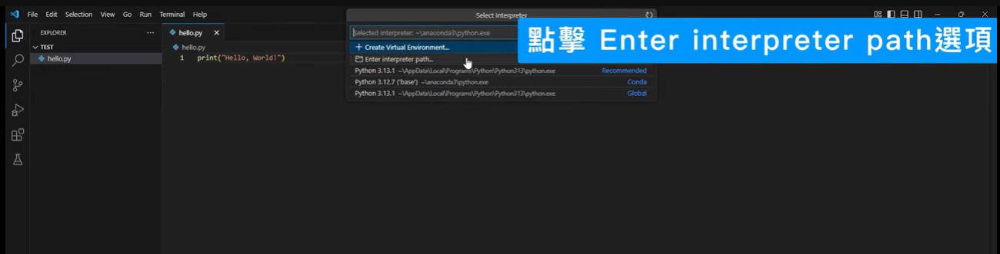

如果看到 `Hello, World!` 輸出，恭喜你完成了第一個 Python 程式！

---

## 常見問題

### Q: 輸入 `python` 顯示找不到指令？
A: 安裝 Python 時沒有勾選「Add Python to PATH」。請重新安裝並勾選該選項，或手動將 Python 路徑加入系統環境變數。

### Q: pip 安裝套件失敗？
A:
1. 確認虛擬環境已啟動（命令列前方有 `(.venv)`）
2. 嘗試升級 pip：`python -m pip install --upgrade pip`
3. 如果是網路問題，可以使用國內鏡像源

### Q: VSCode 找不到虛擬環境的 Python？
A: 按 `Ctrl+Shift+P`，輸入「Python: Select Interpreter」，手動選擇 `.venv` 資料夾中的 Python。

---

## 下一步

環境設定完成後，你可以：

1. 前往 [DAY1](../DAY1/README.md) 開始學習 OpenCV 基礎
2. 安裝課程所需套件：
   ```bash
   pip install opencv-python numpy mediapipe ultralytics customtkinter pillow
   ```
3. 執行第一個範例：
   ```bash
   cd DAY1
   python step01_read_image.py
   ```

祝學習愉快！
